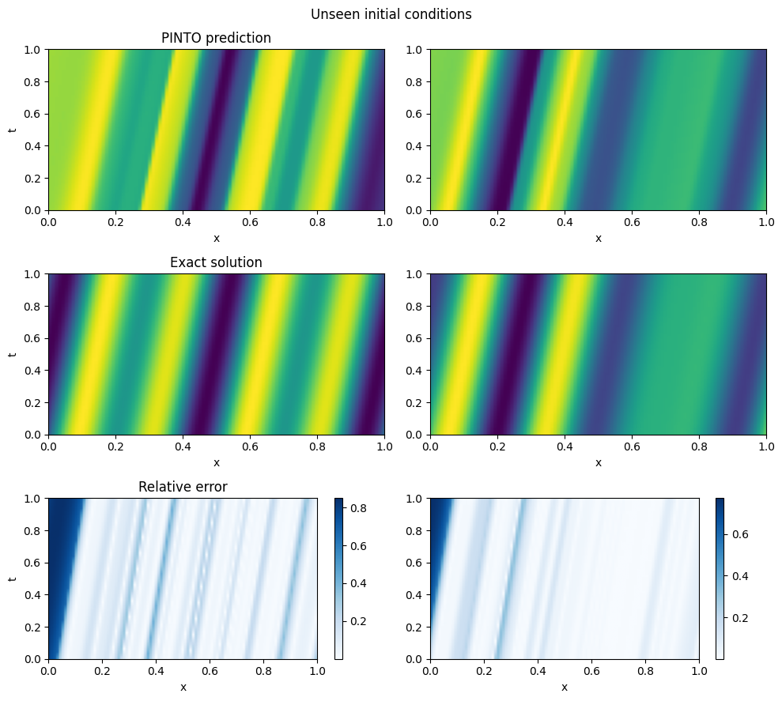
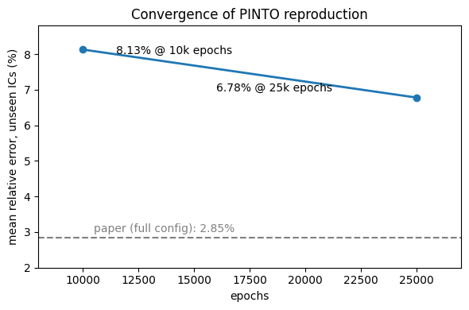
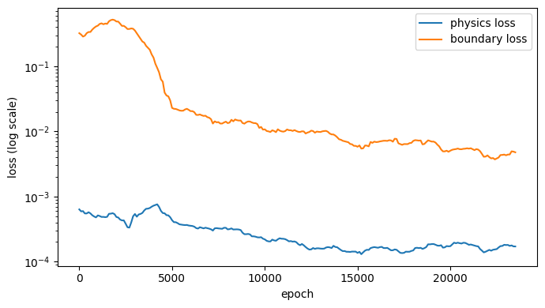
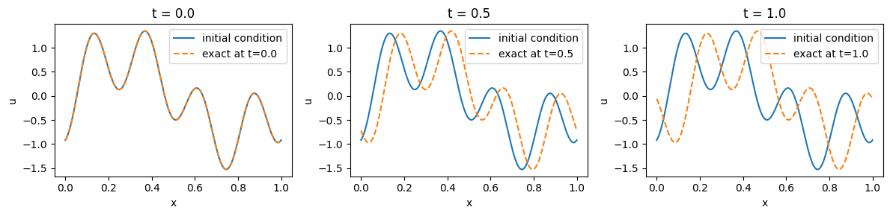

# PINTO Reproduction: 1D Advection Equation (Reduced Configuration)

An independent, reduced-configuration reproduction of the **1D advection test
case** from:

> S. K. Boya, D. N. Subramani, *"PINTO: Physics-informed transformer neural
> operator for learning generalized solutions of partial differential
> equations for any initial and boundary condition,"*
> Computer Physics Communications 315 (2025) 109702.
> [DOI](https://doi.org/10.1016/j.cpc.2025.109702) ·
> [Original code](https://github.com/quest-lab-iisc/PINTO)

**Headline result: 6.78% mean relative error on 15 unseen initial conditions**
(paper: 2.85% at full scale on a 48GB A6000), with a **seen–unseen gap of
~1.6%** (5.2% seen vs. 6.8% unseen), the model generalizes to new initial
conditions instead of memorizing the training set.

## What PINTO does ?

PINTO is a transformer-based neural operator that maps initial/boundary
conditions to PDE solutions, trained **using only physics loss i.e. no
simulation data**. Boundary conditions enter as a *sequence* of (position,
value) tokens through cross-attention, so one trained model solves the PDE
for **any** unseen initial condition. This implementation follows the paper's
three-stage architecture: (i) query-point, boundary-position, and
boundary-value encoders (lifting MLPs); (ii) cross-attention units
implementing the iterative kernel integral operator (Eqs. 5–8); (iii) output
projection MLP. Training minimizes the PDE residual (∂u/∂t + β ∂u/∂x,
computed via autograd) plus a weighted boundary-condition loss (Eq. 3).

## Results

| Metric | This repo | Paper (full config) |
|---|---|---|
| Mean rel. error, unseen ICs | **6.78%** | 2.85% |
| Mean rel. error, seen ICs | 5.2% | 2.11% |
| Seen–unseen gap | ~1.6% | ~0.7% |



### Configuration comparison

| | Paper | This repo |
|---|---|---|
| Training ICs | 80 | 80 |
| Test ICs (unseen) | 20 | 15 |
| Epochs | 20,000 | 25,000 |
| Sequence length L | 80 | 60 |
| Boundary setup | Dirichlet; FD reference (PDEBENCH) | Periodic domain; analytic reference |
| Hardware | RTX A6000 48GB | Free-tier Colab GPU |

### Findings from my runs

**1. Slow PINN-style convergence.** Unseen error improved 8.13% → 6.78%
going from 10k to 25k epochs (~1.35% for 2.5× compute) — physics-residual
training has a long convergence tail, consistent with the paper's 20k-epoch
budget.





**2. Boundary-loss weight matters and has an optimum.** A small ablation
of the boundary weight λ₂ (run early in training, at 3k epochs) found
error ≈30% at λ₂=10, ≈28% at λ₂=25, and >30% at λ₂=50. The final model used
λ₂=10 with 25k epochs. The loss curves shows why the balance is delicate:
even with a modest λ₂, the boundary loss ends ~25× larger than the physics
loss, increasing λ₂ further starves the physics residual. This resembles to
the loss-imbalance discussion in the paper's Limitations section.

**3. Capacity-limited, not overfitting.** Seen (5.2%) and unseen (6.8%)
errors are close, so at this scale the bottleneck is convergence/capacity
rather than memorization of the 80 training ICs — more epochs and longer
boundary sequences (paper's ablation: L=40→60 alone cut error 7.21%→2.61%)
are the higher-yield levers, simply increasing the number of training ICs does not solve the issue.



## Deviations from the paper (and why)

1. **Periodic domain with analytic reference** — u(x,t) = u₀((x − βt) mod 1)
   — instead of Dirichlet boundaries with PDEBENCH finite-difference data.
   Rationale: exact ground truth, no dataset dependency; boundary tokens
   consist of the t=0 line only. A deliberate simplification, not an
   oversight.
2. **Reduced scale** (see table) within a free-tier GPU budget.
3. Attention implemented via `nn.MultiheadAttention` (2 heads, dim 64),
   following the architecture of Table B.6 rather than every implementation
   detail.


## References

- Boya & Subramani, CPC 315 (2025) 109702 — [paper](https://doi.org/10.1016/j.cpc.2025.109702) · [original code](https://github.com/quest-lab-iisc/PINTO)
- [PDEBENCH](https://github.com/pdebench/PDEBench) (validation data in the paper)
````
